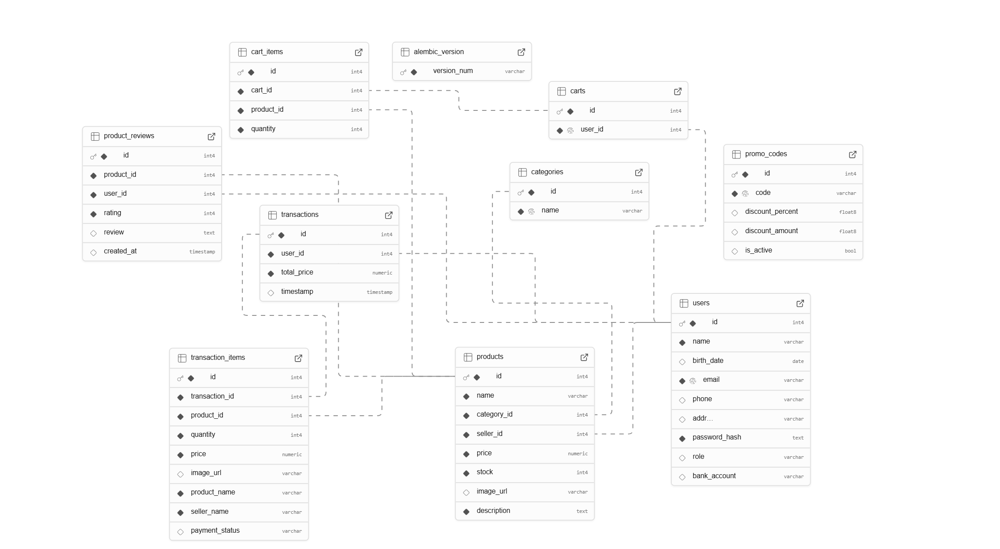

# Karya Rasa Backend API

This is a backend project for the Karya Rasa website

**KaryaRasa** is a backend project for a local e-commerce application that sells creative and culinary products. 
This API is built using Python and Flask and provides user authentication, product management, and shopping cart features.

> 🚧 This project was developed collaboratively with the team. 

The members who responsibel for this backend project are:

 - Ridwan Amirul Maulana
 - Fytrio Amando


## 🌐 Live Deployment

[https://dying-helli-ridwanam9-4b98d171.koyeb.app](https://dying-helli-ridwanam9-4b98d171.koyeb.app)


## Entity Relationship Diagram



## ⚙️ Key Features

- 🔐 User authentication (Register & Login) using JWT
- 📦 Product CRUD
- 🛒 Per-user cart management
- 🔐 Middleware for route protection
- 🌍 API connected to Next.js based frontend

## 🧰 Technologies Used

- **Python** + **Flask**
- **PostgreSQL** + **SQLAlchemy**
- **JWT** (Flask-JWT-Extended)
- **CORS**, **dotenv**, etc


## 🛠 **Installation & Setup**

### **1. Clone Repository**

```sh
git clone https://github.com/ridwanam9/KaryaRasa_backend.git
cd KaryaRasa_backend
```

### **2. Activate Environment(venv)**

First install python vitual environment

```sh
python -m venv venv
```
and then activate the environment

```sh
venv\Scripts\activate
```
After activation, you should see (venv) before your command prompt:

```sh
(venv) C:\path\to\your\flask_project>
```

### **3. install requirements from requirments.txt**


```sh
pip install -r requirements.txt
```

### **4. Run Project**

```sh
flask --app main run
```
